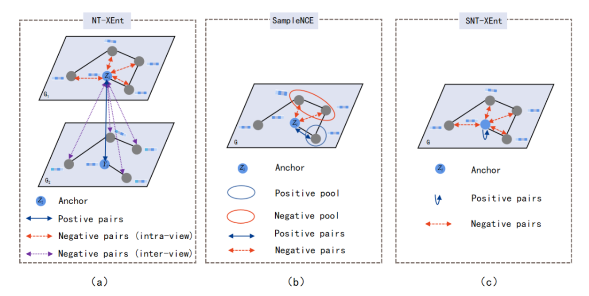

# Rethinking graph contrastive learning: an efficient single-view approach via instance discrimination
Pytorch implementation for the paper "Rethinking graph contrastive learning: an efficient single-view approach via instance discrimination". [LSGCL](https://ieeexplore.ieee.org/abstract/document/10286310)

## Absrtact
With the successful integration of contrastive learning and graph neural networks, graph contrastive learning (GCL) has demonstrated superior performance in graph representation learning. Majority of earlier works tend to utilize dual-view frameworks. However, they require high computational costs; additionally, we observed that they can hardly obtain robust result as the training processes swing between two important metrics: alignment and uniformity. We address these problems by designing a novel single-view paradigm called Light Single-view Graph Contrastive Learning (LSGCL). To reduce time consumption, we use a single-view framework. Specifically, the input graph is fed directly into a message-passing pattern encoder by concatenating the row-wise normalized hidden representations. Next, a novel single-view instance discrimination is applied, redefining the anchor, positive, and negative samples. The anchor is the positive sample, and the other nodes are negative. We also discuss why LSGCL can successfully achieve the trade-off between alignment and uniformity. In particular, the obtained representation is perfectly aligned, and visualizations show that the representation can provide cutting-edge value under uniformity. Albeit simple, our LSGCL can produce comparable performance or better than state-of-the-art methods while only incurring about 20\% time cost compared to the state-of-the-art baselines.




## Training LSGCL
Taking the dataset Photo as an example, run the following command to obtain the experimental results:
    
    
    python main.py   --dataset  Photo    --lr 0.001  --weight_decay  5e-5  --tau=0.1

## Acknowledgements
The implementation of this code is largely built upon [LSGCL](https://github.com/maxgaocode/LSGCL)

## Citation
```bibtex
@article{gao2023rethinking,
  title={Rethinking Graph Contrastive Learning: An Efficient Single-View Approach via Instance Discrimination},
  author={Gao, Yuan and Li, Xin and Yan, Hui},
  journal={IEEE Transactions on Multimedia},
  year={2023},
  publisher={IEEE}
}
```